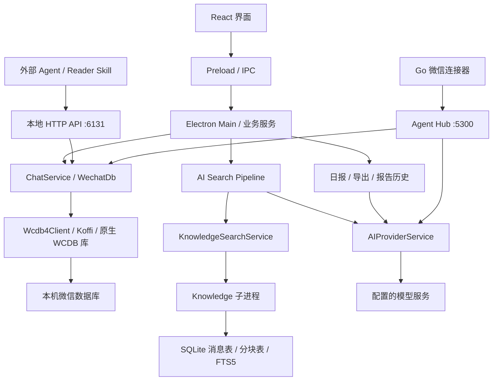

# TraceMemo：结构化输出策略与后端源码审查

审查日期：2026-09-14。仓库：[Wxw-Gu/TraceMemo](https://github.com/Wxw-Gu/TraceMemo)。固定版本为 main 的 `485ccbc42a0291026702ebbe5b9aed757f25cbb4`，提交时间 2026-09-10，package 版本 2.3.0。以下结论来自该快照的业务源码和测试，没有启动 TraceMemo，也没有调用模型。

**TraceMemo 的主要处理方式是减少最终回答的结构负担、容错解析、局部修复与降级。它没有在这些路径中通过 Instructor/Pydantic 建立与 Wememo 相同的严格契约。** 因而不能把它能展示的结果，直接算作 Wememo 的结构与引用通过。

## 1. AI Search：最终回答主要是文本

AI Search 把检索与生成分开。程序收集候选消息、排序、去重、选择 Final Evidence，并为其分配 `E1`、`E2` 等编号；模型收到最终选定的证据与本地统计，生成带 `[E#]` 引用的中文回答。最终答案没有采用 Wememo 的 findings / alternativeExplanations 严格 JSON 契约。

检索规划过程中仍使用小型 JSON 控制协议，决定下一次检索或结束。解析器从文本提取 JSON，检查动作和工具名；无效时进入本地检索降级。它通过普通 chat 请求取得决策文本，这条路径并非 DeepSeek 原生 `tool_calls` 协议。[规划器](https://github.com/Wxw-Gu/TraceMemo/blob/485ccbc42a0291026702ebbe5b9aed757f25cbb4/src/main/services/ai-search-agent.ts#L50)、[决策调用](https://github.com/Wxw-Gu/TraceMemo/blob/485ccbc42a0291026702ebbe5b9aed757f25cbb4/src/main/services/ai-search-pipeline-service.ts#L1603)

最终引用处理采用 `sanitizeAnswerCitations()`：

1. 识别回答中形如 `[E数字]` 的标记。
2. 编号存在于 Final Evidence 时保留。
3. 不存在时删除该标记，记录无效编号，状态为 `sanitized`。
4. 主流程仍返回完成后的回答，并提示引用已经清理。

它不会因为一个无效标记而拒绝整个回答，也不会在这里删除对应论断。这一行为有专门单元测试。[引用处理](https://github.com/Wxw-Gu/TraceMemo/blob/485ccbc42a0291026702ebbe5b9aed757f25cbb4/src/main/services/ai-search-evidence.ts#L252)、[完成状态](https://github.com/Wxw-Gu/TraceMemo/blob/485ccbc42a0291026702ebbe5b9aed757f25cbb4/src/main/services/ai-search-pipeline-service.ts#L883)、[测试](https://github.com/Wxw-Gu/TraceMemo/blob/485ccbc42a0291026702ebbe5b9aed757f25cbb4/tests/unit/ai-search-evidence.test.ts#L109)

本次直接执行该快照的纯引用处理函数，三项离线检查结果如下。输入证据集合仅包含 `E1`，没有任何模型请求：

| 输入 | 输出 | 状态 |
|---|---|---|
| `这条说法有依据。[E999]` | `这条说法有依据。` | sanitized，记录 E999 |
| `这条说法没有引用。` | 原文不变 | valid |
| `这条说法有依据。[E1]` | 原文不变 | valid |

所以这里的 `valid` 表示没有发现无法对应的指定格式引用，不能解释为“每个论断都有证据”。该函数也没有 Wememo 的 support / counter / context 方向规则。TraceMemo 官方来源说明同样将可追溯性与事实保证区分开来。[来源核对说明](https://github.com/Wxw-Gu/TraceMemo/blob/485ccbc42a0291026702ebbe5b9aed757f25cbb4/docs/concepts/answer-sources.md)

## 2. 群聊日报：JSON 修复与字段整理

日报确实要求模型输出复杂 JSON，但接收策略较宽：先移除代码围栏、提取对象，尝试严格解析；语法失败后调用 JavaScript `jsonrepair`。之后构造新的报告对象，忽略未读取的额外字段，把缺少的数组变成空数组、部分缺失值设为默认值，并过滤无效条目。没有有效话题仍会抛错。[解析与整理](https://github.com/Wxw-Gu/TraceMemo/blob/485ccbc42a0291026702ebbe5b9aed757f25cbb4/src/renderer/src/utils/group-report.ts#L230)、[报告组装](https://github.com/Wxw-Gu/TraceMemo/blob/485ccbc42a0291026702ebbe5b9aed757f25cbb4/src/renderer/src/utils/group-report.ts#L787)

若这一整套本地解析仍失败，桌面日报和 Agent 日报都额外调用一次模型，请它修复原输出，再进行解析；再次失败才返回错误。桌面流程会显示修复步骤，并合并 token 用量。[桌面修复流程](https://github.com/Wxw-Gu/TraceMemo/blob/485ccbc42a0291026702ebbe5b9aed757f25cbb4/src/renderer/src/hooks/useGroupReportGeneration.ts#L537)、[Agent 日报修复流程](https://github.com/Wxw-Gu/TraceMemo/blob/485ccbc42a0291026702ebbe5b9aed757f25cbb4/src/main/services/agent-group-report-service.ts#L138)

这解释了为何同一类模型错误可能产生不同体验：Wememo 的额外字段会导致 `expected exact keys`；TraceMemo 日报可能只取自己需要的字段后继续。前者记录的是严格遵循率，后者还包含修复与整理后的可展示率。源码审查不能据此给出两者的真实模型成功率比较。

图片理解也采用手写的容错解析：提取 JSON、要求存在 description，对其他值进行转换或设置默认值。它不是统一的严格 Schema 校验服务。[图片解析](https://github.com/Wxw-Gu/TraceMemo/blob/485ccbc42a0291026702ebbe5b9aed757f25cbb4/src/main/services/image-insight-prompt.ts#L52)

## 3. 后端：Electron 主进程中的本地服务

核心是 React Renderer、Preload、Electron Main 和 TypeScript 服务。Main 创建服务并注册 IPC，负责数据读取、模型请求、知识检索、导出等工作；另有独立知识库子进程和 Go 微信连接器。[主进程装配](https://github.com/Wxw-Gu/TraceMemo/blob/485ccbc42a0291026702ebbe5b9aed757f25cbb4/src/main/index.ts#L601)、[技术依赖](https://github.com/Wxw-Gu/TraceMemo/blob/485ccbc42a0291026702ebbe5b9aed757f25cbb4/package.json)

图中是职责示意，省略媒体、监控及发送等支线；不是所有功能都必须经过 AI Search。

### 数据读取与派生索引分离

原始消息通过 `WechatDb → Wcdb4Client` 读取，后者使用 Koffi 调用平台原生 WCDB 库。知识库是另建的本地 SQLite 文件，按账号分目录，保存标准化消息、聊天分块和增量索引状态。[数据访问](https://github.com/Wxw-Gu/TraceMemo/blob/485ccbc42a0291026702ebbe5b9aed757f25cbb4/src/main/wechat-db.ts#L68)、[原生桥接](https://github.com/Wxw-Gu/TraceMemo/blob/485ccbc42a0291026702ebbe5b9aed757f25cbb4/src/main/wcdb4-client.ts#L2398)

已查看的知识检索实现以 FTS5、BM25、关键词与范围过滤为基础；不能把其中的 Knowledge 自动理解为向量数据库。表包括 `knowledge_messages`、`knowledge_chunks`、`knowledge_index_state` 和 `knowledge_fts`。[知识存储与检索](https://github.com/Wxw-Gu/TraceMemo/blob/485ccbc42a0291026702ebbe5b9aed757f25cbb4/src/main/knowledge/knowledge-store.ts#L375)

知识库使用 `node:sqlite` 同步接口，但放在 `child_process.fork()` 创建的子进程里执行，通过带 requestId 的消息回传进度和结果。这是让索引、SQL 查询与主进程响应分开的工程设计。[Worker Host](https://github.com/Wxw-Gu/TraceMemo/blob/485ccbc42a0291026702ebbe5b9aed757f25cbb4/src/main/knowledge/knowledge-worker-host.ts#L30)

### 搜索编排与模型适配分离

Pipeline 负责确定范围、联系人身份、检索、证据选择、回答生成和引用清理。规划器有六个白名单检索工具，默认最多五次工具调用；联系人回顾路径设为两次。会话和消息引用由本地发放，执行时检查是否属于本次允许范围。[工具与预算](https://github.com/Wxw-Gu/TraceMemo/blob/485ccbc42a0291026702ebbe5b9aed757f25cbb4/src/main/services/ai-search-agent.ts#L3)、[引用授权检查](https://github.com/Wxw-Gu/TraceMemo/blob/485ccbc42a0291026702ebbe5b9aed757f25cbb4/src/main/services/ai-search-pipeline-service.ts#L1168)

`AIProviderService` 负责配置、鉴权、接口转换、流式解析、超时及错误处理，支持 OpenAI 兼容 Chat、Responses 和 Anthropic 等请求路径。查看到的 Chat/Responses 请求构造没有设置 `response_format` 或 `text.format` JSON Schema；这里主要依靠提示词与后处理满足业务格式。[请求构造](https://github.com/Wxw-Gu/TraceMemo/blob/485ccbc42a0291026702ebbe5b9aed757f25cbb4/src/main/services/ai-provider-service.ts#L746)

### 模型配置与密钥分开

Provider 名称、base URL、模型与高级参数存入 `ai-providers.json`。API key 单独由 Electron `safeStorage` 加密保存到 `ai-provider-keys.bin`，文件权限设为 `0600`；系统安全存储不可用时拒绝保存。[配置文件](https://github.com/Wxw-Gu/TraceMemo/blob/485ccbc42a0291026702ebbe5b9aed757f25cbb4/src/main/services/ai-provider-service.ts#L525)、[密钥存储](https://github.com/Wxw-Gu/TraceMemo/blob/485ccbc42a0291026702ebbe5b9aed757f25cbb4/src/main/ai-provider-key-store.ts#L10)

### 外部 Agent 与微信机器人是两个入口

Local HTTP API 默认监听 `127.0.0.1:6131`，健康检查公开，其余业务端点要求 Bearer Token，并检查浏览器 Origin。它供本机 Reader Skill、CLI 和外部 Agent 查询使用，没有多用户细粒度权限系统。[HTTP 实现](https://github.com/Wxw-Gu/TraceMemo/blob/485ccbc42a0291026702ebbe5b9aed757f25cbb4/src/main/http-server.ts#L589)、[API 安全说明](https://github.com/Wxw-Gu/TraceMemo/blob/485ccbc42a0291026702ebbe5b9aed757f25cbb4/docs/agent/api-security.md)

Go `wechat-connector` 负责微信登录、消息轮询和收发，由 Electron 管理；Agent Hub 处理入站消息与业务调用。Go 连接器本身不是 LLM 推理后端。[连接器说明](https://github.com/Wxw-Gu/TraceMemo/blob/485ccbc42a0291026702ebbe5b9aed757f25cbb4/services/wechat-connector/README.md)、[Agent Hub](https://github.com/Wxw-Gu/TraceMemo/blob/485ccbc42a0291026702ebbe5b9aed757f25cbb4/src/main/services/agent-hub-service.ts#L30)

## 4. 与 Wememo 的取舍

| 边界 | TraceMemo 已查看的实现 | Wememo 当前约束 |
|---|---|---|
| 搜索最终输出 | 文本与引用标记 | 严格 reasoning JSON |
| 日报结构异常 | 本地语法修复、字段整理，必要时一次模型修复 | 无修复、无额外字段、无静默补值 |
| 搜索未知引用 | 删除标记，保留正文并提示 | 整体拒绝无效 reasoning 结果 |
| 引用方向 | 当前搜索引用函数只检查编号集合 | finding / alternative 分别检查 support 等方向 |
| Renderer 权限 | 同时提供业务 IPC 与通用 `ai:chat` | Reasoning 入口不接受 Renderer Prompt |
| Python | 所审查核心链路未使用 Instructor/Pydantic 服务 | Python 仅用于独立对照实验 |

Renderer 权限这一点需要单独注意：TraceMemo 的桌面日报会在 Renderer 组织 messages，再调用通用 `ai:chat`；Main 负责发起网络请求，但并非所有 Prompt 都由 Main 构造。Wememo 已明确限制 Renderer 只能提交业务请求，因此不应直接复用这一接口设计。[通用 IPC](https://github.com/Wxw-Gu/TraceMemo/blob/485ccbc42a0291026702ebbe5b9aed757f25cbb4/src/main/index.ts#L1221)

适合 Wememo 借鉴的是：把确定性统计从模型输出移到程序中、独立管理可重建的检索索引、用子进程承接耗时任务、分开配置与密钥、区分检索覆盖和生成失败。当前应继续保留严格契约、deliveredIds 与引用方向验证。

如未来评估修复流程，应另设显式实验路径，分别记录首次通过、修复后通过、额外调用与语义变化，不能合并成零重试通过率。本次没有把任何 TraceMemo 策略移入 Wememo 生产代码。

## 审查范围

阅读了上述固定提交的 Provider、AI Search、Evidence、日报、知识库、IPC、密钥、本地 API 与连接器源码，并核对相关测试。额外只执行了引用函数的三项合成检查；没有运行 TraceMemo 完整测试套件，未测其真实模型成功率。源码快照位于 `/private/tmp/wememo-tracememo-review-20260914`，可被系统清理，文中 GitHub 链接均固定到提交。
